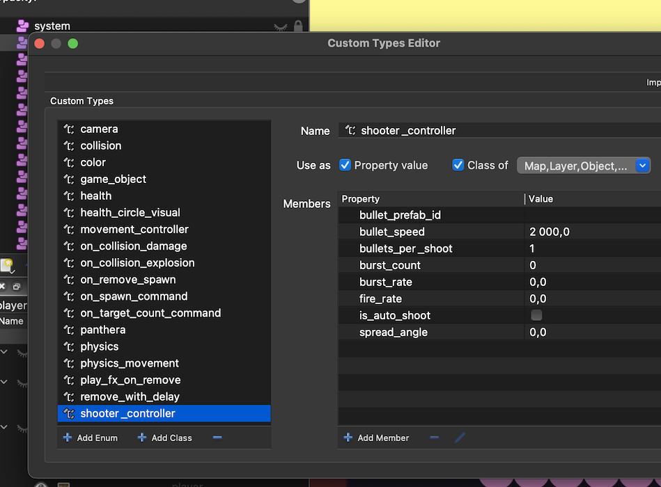

# Shooting Circles

This project was created for the [Explosion Community](https://forum.defold.com/t/community-challenge-explosions/77315) challenge, and it goes a bit beyond the initial scope.

Shooting Circles is a simple game example built using only the ECS architecture for Defold (I think it pretty close to Pure ECS). Below, you will find a detailed description of the different parts of the project. If you are interested in the code structure and ECS, welcome!

## Overview

### Restrictions
- Use the [tiny-ecs](https://github.com/bakpakin/tiny-ecs) library without modifications.
- Entities are created using regular tables `{}`.
- No external `require()` calls in systems to maintain portability between projects.
- Components can only be modified within one system. For example, `entity.transform.x = 10` cannot be set in a non-transform system.
- Entities should only contain data, not logic.
- Sure no any global variables.
- The GUI collection should be able to run as the game’s bootstrap collection.

### Game Flow
The initial script is `/loader/loader.script`, which initializes all libraries and loads the game.collection.
The `/game/game.script` script creates a world, loads systems, and loads a level with level_loader_command.
All other logic is handled through the ECS systems, located in the `/systems` folder.

### Systems
- All systems are placed in the `/systems` folder.
- Systems can return multiple sub-systems.
- Systems are divided into "system", "system_command", and "system_event":
  - **System**: Filters entities by required components and processes them. It usually returns up to three sub-systems: system, system_command. Contains all system logic and events this system handling (in `postWrap` function).
  - **System Command**: Describes an external API for the system with the "system_command" component. To spawn a command for the system, call `self.world.system_command:method_name()`. Awailable from all systems.
- Systems can register components in Decore, so usually the registration placed in system files under system component annotation. Example: `transform_system` registers `transform` component with all default values. If they exists here, they will be used as defaults for all new components.
```lua
decore.register_component("transform", {
	position_x = 0,
	position_y = 0,
	position_z = 0,
	size_x = 1,
	size_y = 1,
	scale_x = 1,
	scale_y = 1,
	rotation = 0,
})
```

### Creating a New System
To create a new system, I use the `system_*` template located in `/decore/templates` and replace `TEMPLATE` with the system name. Then, add the system to the `game.script` in the system list. That’s all it takes to create a new system.


## Decore

**[Decore](https://github.com/Insality/decore)** is a library that manages data collections for ECS and allows the creation of entities from prefabs.

- All decore entities are created from prefabs.
- World are created from "world_prefabs"
- All prefabs registered in the `game.script` in the `init_decore()` in `load_entities()` and `load_worlds()` functions.
- Some of prefabs created from Tiles tileset and maps, using Detiled library.
- Other prefabs can be registered in place from your lua tables.


## Tiled

To view the [Tiled](https://www.mapeditor.org/) project, open `tiled/game_shooting_circle.tiled-project`.

### Exporting
Each map and tileset is exported as JSON and placed in custom resources folders:
- Maps are placed in the `resources/maps` folder.
- Tilesets are placed in the `resources/tilesets` folder.

This loading happens in the `game.script` to convert tiled tilesets and maps to Decore prefabs.

### Tiled Custom Types Editor
Tiled has a Custom Types Editor that is well-suited for describing ECS entities. Open `View -> Custom Types Editor` to see the components defined for this project.



To use these components, add them to an entity in the tileset or instance in the world and override the fields. You can also use the "object" type of property field to link to other entities in the world.

### Overriding Properties
Default values are always used in the custom types. Only describe the fields you need to manipulate or add to the entity.

- Add components and set default property values for each tileset entity.
- In maps, you can override the properties of the entity. However, doing so will replace the entire component with the new one. Therefore, changes to Tileset Entity properties will not be reflected in the map.


## Tests
I included a few tests to check how we can add unit tests to the systems. Look at `/test` folder for more details.