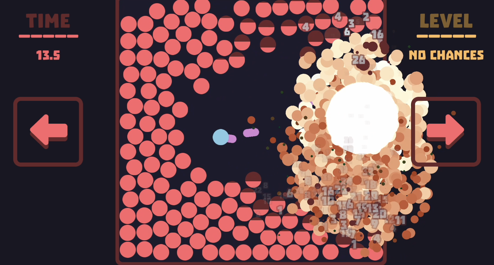

# Shooting Circles

This project was created for the [Explosion Community](https://forum.defold.com/t/community-challenge-explosions/77315) challenge, and it goes a bit beyond the initial scope.

Shooting Circles is a simple game example built using only the tiny-ecs library. It's a ECS-kind of implementation, where I have a systems, entities and a world. Systems have a states and external API. Levels are created as a collections and when spawned they will create a new entities.

## Overview

### Game Flow
The initial script is `/loader/loader.script`, which initializes all libraries and loads the game.collection.
The `/game/game.script` script creates a world, loads systems, and loads a level with level_loader_command.
All other logic is handled through the ECS systems, located in the `/systems` folder.

### Systems
- All systems are placed in the `/systems` folder.
  - **System**: Filters entities by required components and processes them. It usually returns up to three sub-systems: system, system_command. Contains all system logic and events this system handling (in `postWrap` function).
  - **System Command**: Describes an external API for the system with the "system_command" component. To spawn a command for the system, call `self.world.system_command:method_name()`. Awailable from all systems.
- Systems can register components in Decore, so usually the registration placed in system files under system component annotation. Example: `transform_system` registers `transform` component with all default values. If they exists here, they will be used as defaults for all new components.
```lua
decore.register_component("transform", {
	position_x = 0,
	position_y = 0,
	position_z = 0,
	size_x = 1,
	size_y = 1,
	scale_x = 1,
	scale_y = 1,
	rotation = 0,
})
```
